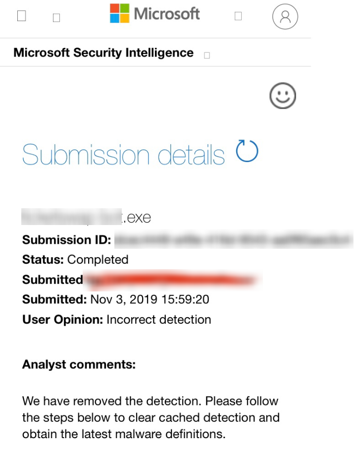

# Protected file is detected as a virus ?

NETGuard.IO Obfuscator uses state-of-the-art techniques to scramble your original code and ensure decompiled code is hard to understand.

"Standard" .NET code is well-known from Antiviruses database,became some malware hides themself from antivirus the same way, so when one .NET file comes with non-standard code and anti debugging / runtime memory edition, some Antivirus might get triggered.

You shall contact Antivirus false positive report system :ans ask them to remove the false detection\(s\) on your protected file. Note that they will ask you to send them the file.

Here are some of the most-used antivirus false report service :

* [ ] Kasperskpy : [https://virusdesk.kaspersky.com/\#scanresults](https://virusdesk.kaspersky.com/#scanresults)
* [ ] Avast : [https://www.avast.com/en-us/false-positive-file-form.php](https://www.avast.com/en-us/false-positive-file-form.php)
* [ ] Windows Defender : [https://www.microsoft.com/en-us/wdsi/filesubmission](https://www.microsoft.com/en-us/wdsi/filesubmission)
* [ ] Bitdefender : [https://www.bitdefender.com/submit/](https://www.bitdefender.com/submit/)


If you got issue with any of these services please contact our technical support !


