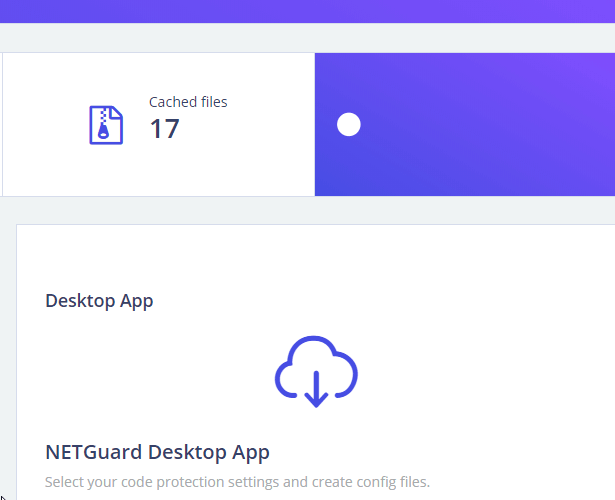
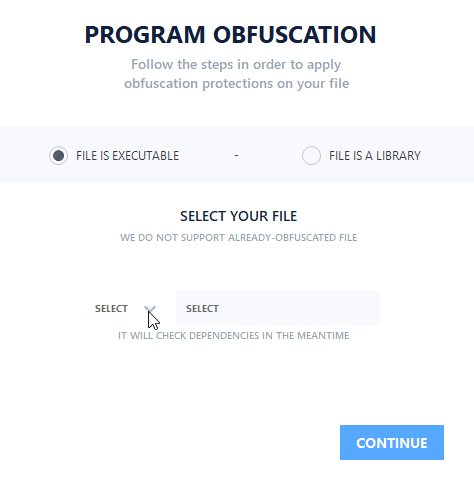
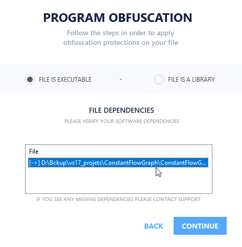
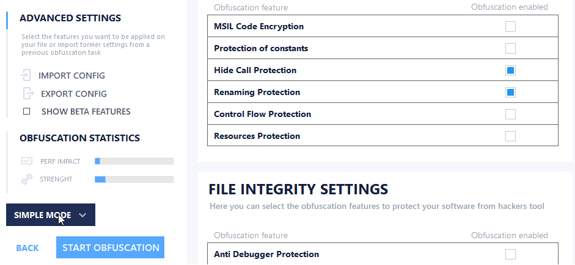

# NETGuard Desktop App


This tutorial supposes you already have an account on NETGuard.IO ! 


## Download Link

> [https://netguard.io/api/desktop\_app.7z](https://netguard.io/api/desktop_app.7z)


Our application is not digitally signed yet. Your antivirus might trigger false positive detection.


## SETP 1 - VERY FIRST LOG IN

Enter your username & password, then click "LOG IN"


Note that you can activate "**AUTO LOGIN NEXT TIME**" 


It will ask you for a secret key, you can find it on your online dashboard : 

## STEP 2 - SELECT THE FILE 

Next please select if your file is "**EXECUTABLE**" \(.exe\) or "**LIBRARY"** \(.dll\)

Then click the select arrow like on the image and once its done please click **CONTINUE**

## STEP 3 - DEPENDENCIES

You will see a list of external dependencies for your file. If you see one missing dependency, please contact us :-\) 

If not, click **CONTINUE**

## STEP 4 - SELECT OBFUSCATION FEATURES

Select the features you want at the right side of the application \(the little white boxed\).


If you have Beta membership you can click on "**SHOW BETA FEATURES**".



If you are premium member, you can click on "**SIMPLE MODE**" to have a more simple menu.


Once you are done, please click "**START OBFUSCATION**". Please wait for your file to be protected.

